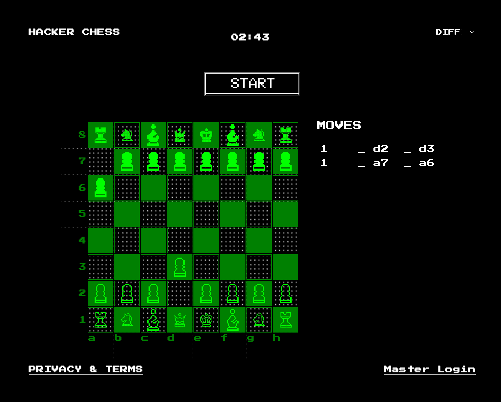
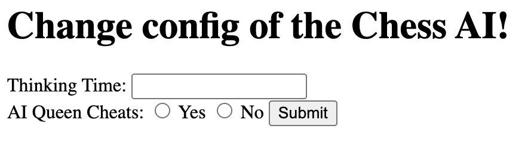

# Hacker Chess
[link](https://hackerchess-web.h4ck.ctfcompetition.com/)



## Step 1
We noticed the following script while looking at the source of the page:
```
function load_baseboard() {
  const url = "load_board.php"
  let xhr = new XMLHttpRequest()
  const formData = new FormData();
  formData.append('filename', 'baseboard.fen')

  xhr.open('POST', url, true)
  xhr.send(formData);
  window.location.href = "index.php";
}
```

## Step 2 
Considering php zhr injection then doppping for something simpler due to the challenge hint suggesting keeping it simple. 
> A clean and fair game of chess. Careful though, this is not a game for grandmasters to win.
>
>Hint: Don't make this game harder than it needs to be.

## Step 3 
Discovered the [MASTER LOGIN](https://hackerchess-web.h4ck.ctfcompetition.com/admin.php) link at the bottom right of the page.

## Step 4
Tried out different user/password combinations with [Burp Suite](https://portswigger.net/burp) checking the response bite size to see when we get a significantly different response. 
We realised a simple SQL Injection gets us passed the login to the Settings page
Injection string used for both `username` and `password`: 
```
' OR '' = '
```

## Step 5 
We saw that in the page we got two inputs, "Thinking Time" and "AI Queen Cheats"so we decided to use [Burp Suite](https://portswigger.net/burp) again to intercept and replay the requests to the admin portal to see if we can get something from injections.



We noticed the + was replaced by a white space and that intrigued us. Unfortunately that was a red herring.
We tried: 
```
1
0
-1
{{1+1}}
{{1-1}}
$(1+1)
;
${{<%[%'"}}%\.
```
Nothing gave any significant results so we went back to the page with the chess game. 

## Step 5
We started exploring the game and realised it has dificulty levels. We again tried to inject values, but that was not successful. 

## Step 6 
We thought, we maybe actually need to play and win but none of us were good at chess, so that did not last long.

## Step 7
We noticed that there are two `GET`parameters that are set during the move. The first called  `move_start` that has the starting cell and `move_end` that contains a string. We used [CyberChef](https://gchq.github.io/CyberChef) to decode the base64 value. e.g.
```
YToyOntpOjA7czoyOiJkMiI7aToxO3M6MjoiZDMiO30=
```
becomes
```
a:2:{i:0;s:2:"d2";i:1;s:2:"d3";}
```
 of the start position and end together with additional text that was not obviously useful/meaningfull. 

## Step 8 
We explored typing in and encoding impossibile moves, but those did not do anything. When duplicating the entire variable value, the chess set stopped showing and we notice an interesting comment `<!-- XXX : Debug remove this -->`. 

## Step 9
When checking if there is another state besides the `GET` variables we noticed that a file called `baseboard.fen` is being passed on fromthe server. On inspection we realised that it contains the state of the board. 
```
rnbqkbnr/pppppppp/8/8/8/8/PPPPPPPP/RNBQKBNR w KQkq - 0 1
```

## Step 10
We wanted to create a new state for us intead of the server `baseboard.fen` but that was not useful since we could not put the file on the server. If we cannot put the file on the server, we decide to explore what other files exist.

## Step 11
We tried out different files and we got the default apache page not found that leaks the opperating system and Apache version.
> Not Found
>
> The requested URL was not found on this server.
> 
> Apache/2.4.41 (Ubuntu) Server at hackerchess-web.h4ck.ctfcompetition.com Port 1337

## Step 12
We shortly considered looking into the `Apache/2.4.41` vulnerabilities, but decided to keep it simple.

## Step 13
We noticed that we can retrieve the file content from the server, so we thought of getting the `index.php` by executing the following in the browsers console: 
```
const url = "load_board.php"
  let xhr = new XMLHttpRequest()
  const formData = new FormData();
  formData.append('filename', 'index.php')

xhr.open('POST', url, true)
xhr.send(formData);
xhr.request
```

## Step 14
In the `index.php` page we noticed there was an interesting code snippet:
```
    $movei = unserialize(base64_decode($_GET['move_end']));
    if ($chess->turn == \"b\") {
      #XXX: this should never happen.
      $chess = init_chess();
      $_SESSION['board'] = serialize($chess);
      die('Invalid Board state. Refresh the page');
    }
    echo \"<!-- XXX : Debug remove this \".$movei. \"-->\";
```
We can get the value of `$movei` returned in the browser as part of the html comment.

## Step 15

We then noticed the success condition and that the value of the flag is stored as an environmental variable.
```
    echo $output->render($chess);
    if ($chess->inCheckmate()) {
        if ($chess->turn != "b") {
            echo '<h1>You lost! Game Over!</h1>';
        } else {
            echo "<h1>ZOMG How did you defeat my AI :(. You definitely cheated. Here's your flag: ". getenv('REDIRECT_FLAG') . "</h1>";
        }
    }
```

## Step 16
Since we knew from Step 11 that the server is running Ubntu with Apache and one of the group suggested retrieveving the environment variable file. This is possible since in Ubuntu everything is a file.
```
  const url = "."
  let xhr = new XMLHttpRequest()
  const formData = new FormData();
  formData.append('filename', '/proc/self/environ')

  xhr.open('POST', url, true)
  xhr.send(formData);

xhr.response
```
The run returns `500` status code and the content of the environment variables in the response including the `REDIRECT_FLAG`. 

## Step 17
We visited the URL listed in the `REDIRECT_FLAG` and the challenge got marked as completed. 🎉

# Alternative 2 
We still believe there would be a way to exploit the html comment and get the flag that way. See `Step 14`.

## Step 18
We realised that the base64 decoded string is a serialised version of php code. Discovered using [W3Schools](https://www.w3schools.com/php/func_var_unserialize.asp)
e.g.
```
a:3:{i:0;s:3:"Red";i:1;s:5:"Green";i:2;s:4:"Blue";}
```
is
```
array(2) { [0]=> string(2) "d2" [1]=> string(2) "d3" }
```

## Step 19

